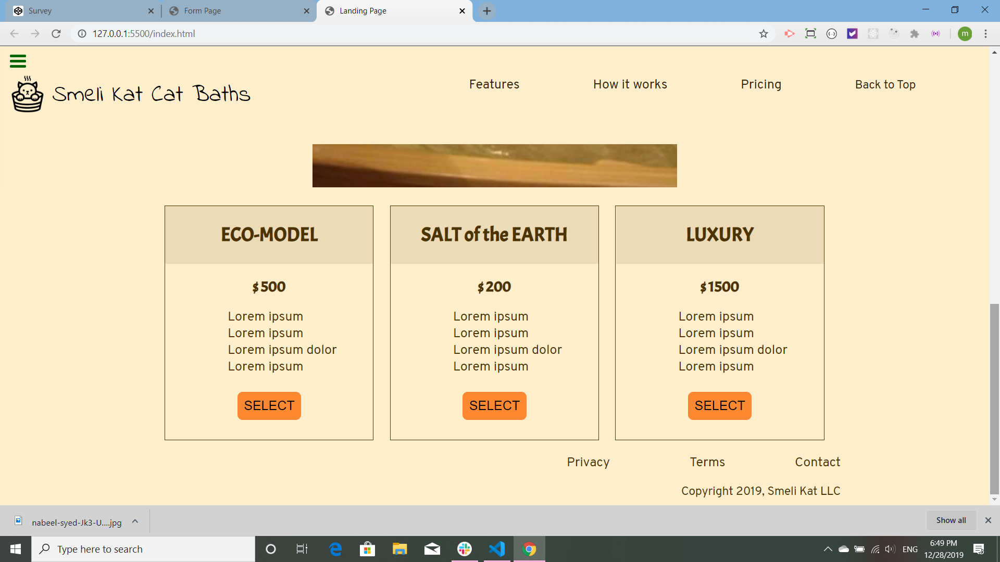

# FCC-landing-page

This landing page is an exercise for [The Free Code Camp](https://www.freecodecamp.org/). All of the CSS is imported into the main CSS, except for that which is responsible for styling the pricing section, because the testing software had problems finding the imported CSS. The Code is all mine. I am leaving the testing software on.

This is the header and top of the page.The header is fixed. Getting the links to work and not go half-way under the header was tough. What worked for me was reseting the scrollbar to have padding-top of the height of the header.

I do not know this cat, nor did I make his bathtub. Notice that the content goes under the header.

This is the bottom of the page and the footer.

This landing page is [published on GitHub](https://martucazpo.github.io/FCC-landing-page/).